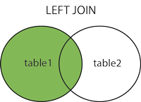
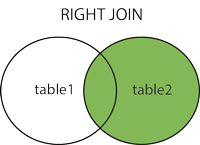
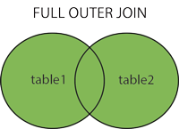

# 1. Introduction to SQL

`SQL` **is a standard language for accessing and manipulating databases**.

What is SQL?

- `SQL stands for Structured Query Language`
- `SQL lets you access and manipulate databases`
- SQL became a standard of the American National Standards Institute (ANSI) in 1986, and of the International Organization for Standardization (ISO) in 1987

What can SQL do?

- SQL can execute queries against a database
- SQL can retrieve data from a database
- SQL can insert records in a database
- SQL can update records in a database
- SQL can delete records from a database
- SQL can create new databases
- SQL can create new tables in a database
- SQL can create stored procedures in a database
- SQL can create views in a database
- SQL can set permissions on tables, procedures, and views

`SQL` is a `Standard` - BUT although SQL is an ANSI/ISO standard, there are different versions of the SQL language.

However, to be compliant with the ANSI standard, they all support at least the major commands (such as `SELECT`, `UPDATE`, `DELETE`, `INSERT`, `WHERE`) in a similar manner.

`RDBMS` is a `Relational Database Management System`.

The data in a `RDBMS` is stored in database objects called `TABLES`.

A `TABLE` is a collection of related data entries and it consists of columns and rows.

Every `TABLE` is broken up into smaller entities called `FIELDS`.

A `FIELD` is a `COLUMN` in a `TABLE` that is designed to maintain specific information about every `RECORD` in the table.

A `RECORD`, also called a `ROW`, is each individual `ENTRY` that exists in a table.

A `RECORD` is a horizontal `ENTITY` in a `TABLE`.

A `COLUMN` is a vertical `ENTITY` in a `TABLE` that contains all information associated with a specific `FIELD` in a `TABLE`.

# 2. SQL Syntax

A database most often contains one or more `TABLES`.
Each `TABLE` is identified by a name (e.g. "Customers" or "Orders").
`TABLES` contain `RECORDS` (`ROWS`) with data.

The table above contains five `RECORDS` (one for each customer) and seven `COLUMNS` (CustomerID, CustomerName, ContactName, Address, City, PostalCode, and Country).

SQL Statements

Most of the actions you need to perform on a database are done with SQL STATEMENTS.

The following SQL STATEMENT selects all the records in the "Customers" table:

```sql
SELECT * FROM Customers;
```

Keep in Mind That...

- SQL keywords are NOT case sensitive: `select` is the same as `SELECT`
- We will write all SQL keywords in upper-case.

Semicolon after SQL Statements?

Some database systems require a semicolon at the end of each SQL statement.

- Semicolon is the standard way to separate each SQL statement in database systems that allow more than one SQL statement to be executed in the same call to the server.
- We will use semicolon at the end of each SQL statement.

Some of The Most Important SQL Commands

- `SELECT` - extracts data from a database
- `UPDATE` - updates data in a database
- `DELETE` - deletes data from a database
- `INSERT INTO` - inserts new data into a database
- `CREATE DATABASE` - creates a new database
- `ALTER DATABASE` - modifies a database
- `CREATE TABLE` - creates a new table
- `ALTER TABLE` - modifies a table
- `DROP TABLE` - deletes a table
- `CREATE INDEX` - creates an index (search key)
- `DROP INDEX` - deletes an index

# 3. SQL `SELECT` Statement

The `SELECT` statement is used to select data from a database.

The data returned is stored in a result table, called the result-set.

## `SELECT` Syntax

```sql
SELECT column1, column2, ...
FROM table_name;
```

Here, column1, column2, ... are the field names of the table you want to select data from. If you want to select all the fields available in the table, use the following syntax:

```sql
SELECT * FROM table_name;
```

## `SELECT` Column Example

The following SQL statement **selects the "CustomerName" and "City" columns from the "Customers" table**:

```sql
SELECT CustomerName, City FROM Customers;
```

## `SELECT *` Example

The following SQL statement **selects all the columns from the "Customers" table**:

```sql
SELECT * FROM Customers;
```

# 4. SQL `SELECT DISTINCT` Statement

The `SELECT DISTINCT` **statement is used to return only distinct (different) values.**

Inside a table, a column often contains many duplicate values; and **sometimes you only want to list the different (distinct) values**.

## `SELECT DISTINCT` Syntax

```sql
SELECT DISTINCT column1, column2, ...
FROM table_name;
```

## `SELECT` Example Without `DISTINCT`

The following SQL statement **selects all (including the duplicates) values from the "Country" column in the "Customers" table**:

```sql
SELECT Country FROM Customers;
```

## `SELECT DISTINCT` Examples

The following SQL statement **selects only the DISTINCT values from the "Country" column in the "Customers" table**:

Example

```sql
SELECT DISTINCT Country FROM Customers;
```

The following SQL statement **lists the number of different (distinct) customer countries**:

```sql
SELECT COUNT(DISTINCT Country) FROM Customers;
```

# 5. SQL `WHERE` Clause

The `WHERE` clause is used to filter records.

It is used to extract only those records that fulfill a specified condition.

## `WHERE` Syntax

```sql
SELECT column1, column2, ...
FROM table_name
WHERE condition;
```

Note: The `WHERE` clause is not only used in `SELECT` statements, it is also used in `UPDATE`, `DELETE`, etc.!

## `WHERE` Clause Example

The following SQL statement selects all the customers from the country "Mexico", in the "Customers" table:

```sql
SELECT * FROM Customers
WHERE Country='Mexico';
```

## Text Fields vs. Numeric Fields

**SQL requires single quotes around text values** (most database systems will also allow double quotes).

However,** numeric fields should not be enclosed in quotes**:

```sql
SELECT * FROM Customers
WHERE CustomerID=1;
```

## **Operators** in The `WHERE` Clause

The following operators can be used in the `WHERE` clause:

`=` **Equal**

`>` **Greater than**

`<` **Less than**

`>=` **Greater than or equal**

`<=` **Less than or equal**

`<>` **Not equal. In some versions of SQL this operator may be written as** `!=`

`BETWEEN` **Between a certain range**

`LIKE` **Search for a pattern**

`IN` **To specify multiple possible values for a column**

# 5. SQL `AND`, `OR` and `NOT` Operators

The `WHERE` clause can be combined with `AND`, `OR`, and `NOT` operators.

The `AND` and `OR` operators are **used to filter records based on more than one condition**.

- **The `AND` operator displays a record if all the conditions separated by `AND` are `TRUE`**.
- **The `OR` operator displays a record if any of the conditions separated by `OR` is `TRUE`**.
- **The `NOT` operator displays a record if the condition(s) is NOT TRUE.**

## `AND` Syntax

```sql
SELECT column1, column2, ...
FROM table_name
WHERE condition1 AND condition2 AND condition3 ...;
```

## `OR` Syntax

```sql
SELECT column1, column2, ...
FROM table_name
WHERE condition1 OR condition2 OR condition3 ...;
```

## `NOT` Syntax

```sql
SELECT column1, column2, ...
FROM table_name
WHERE NOT condition;
```

## `AND` Example

The following SQL statement selects all fields from "Customers" where country is "Germany" AND city is "Berlin":

```sql
SELECT * FROM Customers
WHERE Country='Germany' AND City='Berlin';
```

## `OR` Example

The following SQL statement **selects all fields from "Customers" where city is "Berlin" `OR` "München"**:

```sql
SELECT * FROM Customers
WHERE City='Berlin' OR City='München';
```

The following SQL statement **selects all fields from "Customers" where country is "Germany" `OR` "Spain"**:

```sql
SELECT * FROM Customers
WHERE Country='Germany' OR Country='Spain';
NOT Example
```

The following SQL statement **selects all fields from "Customers" where country is `NOT` "Germany"**:

```sql
SELECT * FROM Customers
WHERE NOT Country='Germany';
```

## Combining `AND`, `OR` and `NOT`

You can also combine the `AND`, `OR` and `NOT` operators.

The following SQL statement **selects all fields from "Customers" where country is "Germany" `AND` city must be "Berlin" `OR` "München" (use parenthesis to form complex expressions)**:

```sql
SELECT * FROM Customers
WHERE Country='Germany' AND (City='Berlin' OR City='München');
```

The following SQL statement **selects all fields from "Customers" where country is `NOT` "Germany" and `NOT` "USA"**:

```sql
SELECT * FROM Customers
WHERE NOT Country='Germany' AND NOT Country='USA';
```

# 5. SQL `ORDER BY` Keyword

**The `ORDER BY` keyword is used to sort the result-set in ascending or descending order.**

- **The `ORDER BY` keyword sorts the records in ascending order by default.**
- **To sort the records in descending order, use the `DESC` keyword.**

## `ORDER BY` Syntax

```sql
SELECT column1, column2, ...
FROM table_name
ORDER BY column1, column2, ... ASC|DESC;
```

## `ORDER BY` Example

The following SQL statement **selects all customers from the "Customers" table, sorted by the "Country" column**:

```sql
SELECT * FROM Customers
ORDER BY Country;
```

## `ORDER BY` DESC Example

The following SQL statement **selects all customers from the "Customers" table, sorted DESCENDING by the "Country" column**:

```sql
SELECT * FROM Customers
ORDER BY Country DESC;
```

## `ORDER BY` Several Columns Example

The following SQL statement **selects all customers from the "Customers" table, sorted by the "Country" and the "CustomerName" column**. `This means that it orders by Country, but if some rows have the same Country, it orders them by CustomerName`:

```sql
SELECT * FROM Customers
ORDER BY Country, CustomerName;
```

## `ORDER BY` Several Columns Example 2

The following SQL statement **selects all customers from the "Customers" table, sorted ascending by the "Country" and descending by the "CustomerName" column**:

```sql
SELECT * FROM Customers
ORDER BY Country ASC, CustomerName DESC;
```

# 6. SQL `INSERT INTO` Statement

**The `INSERT INTO` statement is used to insert new records in a table.**

## `INSERT INTO` Syntax

**It is possible to write the `INSERT INTO` statement in two ways:**

1. **Specify both the column names and the values to be inserted**:

```sql
INSERT INTO table_name (column1, column2, column3, ...)
VALUES (value1, value2, value3, ...);
```

2. **If you are adding values for all the columns of the table, you do not need to specify the column names in the SQL query. However, make sure the order of the values is in the same order as the columns in the table.** Here, the `INSERT INTO` syntax would be as follows:

```sql
INSERT INTO table_name
VALUES (value1, value2, value3, ...);
```

## `INSERT INTO` Example

The following SQL statement **inserts a new record in the "Customers" table**:

Formt of Table:
CustomerId, CustomerName, ContactName, Address, City, PostalCode, Country

```sql
INSERT INTO Customers (CustomerName, ContactName, Address, City, PostalCode, Country)
VALUES ('Cardinal', 'Tom B. Erichsen', 'Skagen 21', 'Stavanger', '4006', 'Norway');
```

Did you notice that we did not insert any number into the CustomerID field?
The CustomerID column is an `auto-increment field` **and will be generated automatically when a new record is inserted into the table**.

## Insert Data Only in Specified Columns

**It is also possible to only insert data in specific columns.**
**If you do not give the other fields a value their value will be `null`.**

The following SQL statement will **insert a new record, but only insert data in the "CustomerName", "City", and "Country" columns (CustomerID will be updated automatically)**:

```sql
INSERT INTO Customers (CustomerName, City, Country)
VALUES ('Cardinal', 'Stavanger', 'Norway');
```

# 7. SQL `NULL` Values

What is a `NULL` Value?

**A field with a `NULL` value is a field with no value.**

**If a field in a table is optional, it is possible to insert a new record or update a record without adding a value to this field. Then, the field will be saved with a `NULL` value.**

**Note: A `NULL` value is different from a zero value or a field that contains spaces. A field with a `NULL` value is one that has been left blank during record creation!**

## How to Test for `NULL` Values?

**It is not possible to test for `NULL` values with comparison operators**, such as `=`, `<`, or `<>`.

We will have to _use the `IS NULL` and `IS NOT NULL` operators_ instead.

## `IS NULL` Syntax

```sql
SELECT column_names
FROM table_name
WHERE column_name IS NULL;
```

## `IS NOT NULL` Syntax

```sql
SELECT column_names
FROM table_name
WHERE column_name IS NOT NULL;
```

## The `IS NULL` Operator

**The `IS NULL` operator is used to test for empty values (`NULL` values)**.

**The following SQL lists all customers with a `NULL` value in the "Address" field**:

```sql
Get your own SQL Server
SELECT CustomerName, ContactName, Address
FROM Customers
WHERE Address IS NULL;
```

Tip: Always use IS NULL to look for NULL values.

## The `IS NOT NULL` Operator

**The `IS NOT NULL` operator is used to test for non-empty values (`NOT NULL` values)**.

The following SQL **lists all customers with a value in the "Address" field**:

```sql
SELECT CustomerName, ContactName, Address
FROM Customers
WHERE Address IS NOT NULL;
```

# 8. SQL `UPDATE` Statement

**The `UPDATE` statement is used to modify the existing records in a table.**

## `UPDATE` Syntax

```sql
UPDATE table_name
SET column1 = value1, column2 = value2, ...
WHERE condition;
```

`Note: Be careful when updating records in a table! Notice the WHERE clause in the UPDATE statement. The WHERE clause specifies which record(s) that should be updated. If you omit the WHERE clause, all records in the table will be updated!`

## `UPDATE` Table

The following SQL statement **updates the first customer (CustomerID = 1) with a new contact person and a new city**.

```sql
Get your own SQL Server
UPDATE Customers
SET ContactName = 'Alfred Schmidt', City= 'Frankfurt'
WHERE CustomerID = 1;
```

## `UPDATE` Multiple Records

It is the `WHERE` clause that determines how many records will be updated.

The following SQL statement **will update the ContactName to "Juan" for all records where country is "Mexico"**:

```sql
UPDATE Customers
SET ContactName='Juan'
WHERE Country='Mexico';
```

## Update Warning!

`Be careful when updating records. If you omit the WHERE clause, ALL records will be updated!`

```sql
UPDATE Customers
SET ContactName='Juan';
```

`WARNING: Now every ContactName on every ROW is Juan (!)`

# 8. SQL `DELETE` Statement

**The `DELETE` statement is used to delete existing records in a table.**

## `DELETE` Syntax

```sql
DELETE FROM table_name WHERE condition;
```

`Note: Be careful when deleting records in a table! Notice the WHERE clause in the DELETE statement. The WHERE clause specifies which record(s) should be deleted. If you omit the WHERE clause, all records in the table will be deleted!`

## SQL `DELETE` Example

The following SQL statement **deletes the customer "Alfreds Futterkiste" from the "Customers" table**:

```sql
DELETE FROM Customers WHERE CustomerName='Alfreds Futterkiste';
```

## `DELETE` All Records

**It is possible to delete all rows in a table without deleting the table. This means that the table structure, attributes, and indexes will be intact**:

```sql
DELETE FROM table_name;
```

## `DELETE` All Records Example

The following SQL statement **deletes all rows in the "Customers" table, without deleting the table**:

```sql
DELETE FROM Customers;
```

# 9. SQL `TOP`, `LIMIT`, `FETCH FIRST` or `ROWNUM` Clause

## The SQL `SELECT TOP` Clause

**The `SELECT TOP` clause is used to specify the number of records to return.**

**The `SELECT TOP` clause is useful on large tables with thousands of records. Returning a large number of records can impact performance.**

Note: Not all database systems support the SELECT TOP clause. **MySQL/Postgres supports the `LIMIT` clause to select a limited number of records**, while Oracle uses `FETCH FIRST n ROWS ONLY` and `ROWNUM`.

## Postgres `LIMIT` Syntax

```sql
SELECT column_name(s)
FROM table_name
WHERE condition
LIMIT number;
```

## Postgres `LIMIT` Example

The following SQL statement **selects the first three records from the "Customers" table** (for Postgres):

```sql
Example
SELECT * FROM Customers
LIMIT 3;
```

## Add A `WHERE` Clause

The following SQL statement **selects the first three records from the "Customers" table, where the country is "Germany"** (for Postgres):

```sql
SELECT * FROM Customers
WHERE Country='Germany'
LIMIT 3;
```

# 10. SQL `MIN()` and `MAX()` Functions

**The `MIN()` function returns the smallest value of the selected column.**

**The `MAX()` function returns the largest value of the selected column.**

## `MIN()` Syntax

```sql
SELECT MIN(column_name)
FROM table_name
WHERE condition;
```

## `MAX()` Syntax

```sql
SELECT MAX(column_name)
FROM table_name
WHERE condition;
```

## `MIN()` Example

The following SQL statement **finds the price of the cheapest product**:

```sql
SELECT MIN(Price) AS SmallestPrice
FROM Products;
```

## `MAX()` Example

The following SQL statement **finds the price of the most expensive product**:

```sql
SELECT MAX(Price) AS LargestPrice
FROM Products;
```

# 11. SQL `COUNT()`, `AVG()` and `SUM()` Functions

**The `COUNT()` function returns the number of rows that matches a specified criterion.**

## `COUNT()` Syntax

```sql
SELECT COUNT(column_name)
FROM table_name
WHERE condition;
```

**The `AVG()` function returns tthe average value of a numeric column.**

## `AVG()` Syntax

```sql
SELECT AVG(column_name)
FROM table_name
WHERE condition;
```

**The `SUM()` function returns the total sum of a numeric column.**

## `SUM()` Syntax

```sql
SELECT SUM(column_name)
FROM table_name
WHERE condition;
```

## `COUNT()` Example

The following SQL statement **finds the number of products**:

```sql
SELECT COUNT(ProductID)
FROM Products;
```

## `AVG()` Example

The following SQL statement **finds the average price of all products**:
`Note: NULL values are ignored.`

```sql
SELECT AVG(Price)
FROM Products;
```

## `SUM()` Example

The following SQL statement **finds the number of products**:
`Note: NULL values are ignored.`

```sql
SELECT SUM(Quantity)
FROM OrderDetails;
```

# 12. SQL `LIKE` Operator

**The `LIKE` operator is used in a `WHERE` clause to search for a specified pattern in a column.**

There are two wildcards often used in conjunction with the `LIKE` operator:

- The percent sign `%` represents zero, one, or multiple characters
- The underscore sign `_` represents one, single character

The percent sign and the underscore can also be used in combinations!

## `LIKE` Syntax

```sql
SELECT column1, column2, ...
FROM table_name
WHERE columnN LIKE pattern;
```

**Tip: You can also combine any number of conditions using `AND` or `OR` operators.**

Here are some examples showing different `LIKE` operators with `%` and `_` wildcards:
LIKE Operator Description
WHERE CustomerName LIKE `'a%'` Finds any values that start with "a"
WHERE CustomerName LIKE `'%a'` Finds any values that end with "a"
WHERE CustomerName LIKE `'%or%'` Finds any values that have "or" in any position
WHERE CustomerName LIKE '`_r%'` Finds any values that have "r" in the second position
WHERE CustomerName LIKE `'a_%'` Finds any values that start with "a" and are at least 2 characters in length
WHERE CustomerName LIKE `'a__%'` Finds any values that start with "a" and are at least 3 characters in length
WHERE ContactName LIKE `'a%o'` Finds any values that start with "a" and ends with "o"

## SQL `LIKE` Examples

The following SQL statement **selects all customers with a CustomerName starting with `"a"`**:

```sql
SELECT * FROM Customers
WHERE CustomerName LIKE 'a%';
```

The following SQL statement **selects all customers with a CustomerName ending with `"a"`**:

```sql
SELECT * FROM Customers
WHERE CustomerName LIKE '%a';
```

The following SQL statement **selects all customers with a CustomerName that have `"or"` in any position**:

```sql
SELECT * FROM Customers
WHERE CustomerName LIKE '%or%';
```

The following SQL statement **selects all customers with a CustomerName that have `"r"` in the second position**:

```sql
SELECT * FROM Customers
WHERE CustomerName LIKE '_r%';
```

The following SQL statement **selects all customers with a CustomerName that starts with `"a"` and are at least 3 characters in length**:

```sql
SELECT * FROM Customers
WHERE CustomerName LIKE 'a__%';
```

The following SQL statement **selects all customers with a ContactName that starts with `"a"` and ends with `"o"`**:

```sql
SELECT * FROM Customers
WHERE ContactName LIKE 'a%o';
```

The following SQL statement **selects all customers with a CustomerName that does NOT start with `"a"`**:

```sql
SELECT * FROM Customers
WHERE CustomerName NOT LIKE 'a%';
```

# 13. SQL Wildcards

**A wildcard character is used to substitute one or more characters in a string.**

**Wildcard characters are used with the `LIKE` operator. The `LIKE` operator is used in a `WHERE` clause to search for a specified pattern in a column.**

## Wildcard Characters in `Postgres`

`%` Represents zero or more characters `bl%` finds bl, black, blue, and blob
`_` Represents a single character `h_t` finds hot, hat, and hit
`[]` Represents any single character within the brackets `h[oa]t` finds hot and hat, but not hit
`^` Represents any character not in the brackets `h[^oa]t` finds hit, but not hot and hat
`-` Represents any single character within the specified range `c[a-b]t` finds cat and cbt

All the wildcards can also be used in combinations!

Here are some examples showing different LIKE operators with `%` and `_` wildcards:

**Finds any values that starts with "a"**

```sql
WHERE CustomerName LIKE 'a%'
```

**Finds any values that ends with "a"**

```sql
WHERE CustomerName LIKE '%a'
```

**Finds any values that have "or" in any position**

```sql
WHERE CustomerName LIKE '%or%'
```

**Finds any values that have "r" in the second position**

```sql
WHERE CustomerName LIKE '_r%'
```

**Finds any values that starts with "a" and are at least 3 characters in length**

```sql
WHERE CustomerName LIKE 'a__%'
```

**Finds any values that starts with "a" and ends with "o"**

```sql
WHERE ContactName LIKE 'a%o'
```

## Using the `%` Wildcard

The following SQL statement **selects all customers with a City starting with "ber"**:

```sql
SELECT * FROM Customers
WHERE City LIKE 'ber%';
```

The following SQL statement **selects all customers with a City containing the pattern "es"**:

```sql
SELECT * FROM Customers
WHERE City LIKE '%es%';
```

## Using the `_` Wildcard

The following SQL statement **selects all customers with a City starting with any character, followed by "ondon"**:

```sql
SELECT * FROM Customers
WHERE City LIKE '_ondon';
```

The following SQL statement **selects all customers with a City starting with "L", followed by any character, followed by "n", followed by any character, followed by "on"**:

```sql
SELECT * FROM Customers
WHERE City LIKE 'L_n_on';
```

## Using the `[charlist]` Wildcard

The following SQL statement **selects all customers with a City starting with "b", "s", or "p"**:

```sql
SELECT * FROM Customers
WHERE City LIKE '[bsp]%';
```

The following SQL statement **selects all customers with a City starting with "a", "b", or "c"**:

```sql
SELECT * FROM Customers
WHERE City LIKE '[a-c]%';
```

## Using the `[!charlist]` Wildcard

The two following SQL statements **select all customers with a City NOT starting with "b", "s", or "p"**:

```sql
SELECT * FROM Customers
WHERE City LIKE '[!bsp]%';
```

Or:

```sql
SELECT * FROM Customers
WHERE City NOT LIKE '[bsp]%';
```

# 13. SQL `IN` Operator

**The `IN` operator allows you to specify multiple values in a `WHERE` clause.**

**The `IN` operator is a shorthand for multiple `OR` conditions.**

## `IN` Syntax

```sql
SELECT column_name(s)
FROM table_name
WHERE column_name IN (value1, value2, ...);
```

or:

```sql
SELECT column_name(s)
FROM table_name
WHERE column_name IN (SELECT STATEMENT);
```

## `IN` Operator Examples

The following SQL statement **selects all customers that are located in "Germany", "France" or "UK"**:

```sql
SELECT * FROM Customers
WHERE Country IN ('Germany', 'France', 'UK');
```

The following SQL statement **selects all customers that are NOT located in "Germany", "France" or "UK"**:

```sql
SELECT * FROM Customers
WHERE Country NOT IN ('Germany', 'France', 'UK');
```

The following SQL statement **selects all customers that are from the same countries as the suppliers**:

```sql
SELECT * FROM Customers
WHERE Country IN (SELECT Country FROM Suppliers);
```

# 14. SQL `BETWEEN` Operator

**The `BETWEEN` operator selects values within a given range. The values can be numbers, text, or dates.**

**The `BETWEEN` operator is inclusive: begin and end values are included.**

## `BETWEEN` Syntax

```sql
SELECT column_name(s)
FROM table_name
WHERE column_name BETWEEN value1 AND value2;
```

## `BETWEEN` Example

The following SQL statement selects all products with a price between 10 and 20:

```sql
SELECT * FROM Products
WHERE Price BETWEEN 10 AND 20;
```

## `NOT BETWEEN `Example

**To display the products outside the range of the previous example, use `NOT BETWEEN`:**

```sql
SELECT * FROM Products
WHERE Price NOT BETWEEN 10 AND 20;
```

## `BETWEEN` with `IN` Example

The following SQL statement **selects all products with a price between 10 and 20. In addition; do not show products with a CategoryID of 1,2, or 3**:

```sql
SELECT * FROM Products
WHERE Price BETWEEN 10 AND 20
AND CategoryID NOT IN (1,2,3);
```

## `BETWEEN` Text Values Example

The following SQL statement **selects all products with a ProductName between Carnarvon Tigers and Mozzarella di Giovanni**:

```sql
SELECT * FROM Products
WHERE ProductName BETWEEN 'Carnarvon Tigers' AND 'Mozzarella di Giovanni'
ORDER BY ProductName;
```

The following SQL statement **selects all products with a ProductName between Carnarvon Tigers and Chef Anton's Cajun Seasoning**:

```sql
SELECT * FROM Products
WHERE ProductName BETWEEN "Carnarvon Tigers" AND "Chef Anton's Cajun Seasoning"
ORDER BY ProductName;
```

## `NOT BETWEEN` Text Values Example

The following SQL statement **selects all products with a ProductName not between Carnarvon Tigers and Mozzarella di Giovanni**:

```sql
SELECT * FROM Products
WHERE ProductName NOT BETWEEN 'Carnarvon Tigers' AND 'Mozzarella di Giovanni'
ORDER BY ProductName;
```

## `BETWEEN` Dates Example

The following SQL statement **selects all orders with an OrderDate between '01-July-1996' and '31-July-1996'**:

```sql
SELECT * FROM Orders
WHERE OrderDate BETWEEN #07/01/1996# AND #07/31/1996#;
```

OR:

```sql
SELECT * FROM Orders
WHERE OrderDate BETWEEN '1996-07-01' AND '1996-07-31';
```

# 15. SQL Aliases with `AS`

**SQL aliases are used to give a table, or a column in a table, a temporary name.**

**Aliases are often used to make column names more readable.**

**An alias only exists for the duration of that query.**

**An alias is created with the `AS` keyword.**

## Alias Column Syntax

```sql
SELECT column_name AS alias_name
FROM table_name;
```

## Alias Table Syntax

```sql
SELECT column_name(s)
FROM table_name AS alias_name;
```

## Alias for Columns Examples

The following SQL statement **creates two aliases, one for the CustomerID column and one for the CustomerName column**:

```sql
SELECT CustomerID AS ID, CustomerName AS Customer
FROM Customers;
```

The following SQL statement **creates two aliases, one for the CustomerName column and one for the ContactName column**.
**Note: It requires double quotation marks or square brackets if the alias name contains spaces:**

```sql
SELECT CustomerName AS Customer, ContactName AS [Contact Person]
FROM Customers;
```

The following SQL statement **creates an alias named "Address" that combine four columns (Address, PostalCode, City and Country)**:

```sql
SELECT CustomerName, Address + ', ' + PostalCode + ' ' + City + ', ' + Country AS Address
FROM Customers;
```

**Note: To get the SQL statement above to work in Postgres use the following:**

```sql
SELECT CustomerName, CONCAT(Address,', ',PostalCode,', ',City,', ',Country) AS Address
FROM Customers;
```

## Alias for Tables Example

The following SQL statement **selects all the orders from the customer with CustomerID=4 (Around the Horn). We use the "Customers" and "Orders" tables, and give them the table aliases of "c" and "o" respectively** (Here we use aliases to make the SQL shorter):

```sql
SELECT o.OrderID, o.OrderDate, c.CustomerName
FROM Customers AS c, Orders AS o
WHERE c.CustomerName='Around the Horn' AND c.CustomerID=o.CustomerID;
```

The following SQL statement **is the same as above, but without aliases**:

```sql
SELECT Orders.OrderID, Orders.OrderDate, Customers.CustomerName
FROM Customers, Orders
WHERE Customers.CustomerName='Around the Horn' AND Customers.CustomerID=Orders.CustomerID;
```

**Aliases can be useful when:**

- **There are more than one table involved in a query**
- **Functions are used in the query**
- **Column names are big or not very readable**
- **Two or more columns are combined together**

# 16. SQL `JOIN`

**A `JOIN` clause is used to combine rows from two or more tables, based on a related column between them.**

Let's look at a selection from the `Orders table`:

```
 orderid | customerid |      orderdate
---------+------------+---------------------
   10248 |         90 | 1996-07-04 00:00:00
   10249 |         81 | 1996-07-05 00:00:00
   10250 |         34 | 1996-07-08 00:00:00
   10251 |         84 | 1996-07-08 00:00:00
   10252 |         76 | 1996-07-09 00:00:00
   10253 |         34 | 1996-07-10 00:00:00
   10254 |         14 | 1996-07-11 00:00:00
   10255 |         68 | 1996-07-12 00:00:00
   10256 |         88 | 1996-07-15 00:00:00
```

Then, look at a selection from the `Customers table`:

```
 customerid |             customername             |     contactname      |   country
------------+--------------------------------------+----------------------+-------------
          1 | Alfreds Futterkiste                  | Maria Anders         | Germany
          2 | Ana Trujillo Emparedados y helados   | Ana Trujillo         | Mexico
          3 | Antonio Moreno Taquería             | Antonio Moreno       | Mexico
          4 | Around the Horn                      | Thomas Hardy         | UK
          5 | Berglunds snabbk├Âp                  | Christina Berglund   | Sweden
          6 | Blauer See Delikatessen              | Hanna Moos           | Germany
          7 | Blondel p├¿re et fils                | Fr├®d├®rique Citeaux | France
          8 | Bólido Comidas preparadas           | Martín Sommer       | Spain
          9 | Bon app''                            | Laurence Lebihans    | France
         10 | Bottom-Dollar Marketse               | Elizabeth Lincoln    | Canada
```

**Notice that the `CustomerID` column in the `Orders table` refers to the `CustomerID` in the `Customers table.`**

**The relationship between the two tables above is the `CustomerID column`.**

Then, we can create the following SQL statement **(that contains an `INNER JOIN`), that selects records that have matching values in both tables:**

```sql
SELECT Orders.OrderID, Customers.CustomerName, Orders.OrderDate
FROM Orders
INNER JOIN Customers ON Orders.CustomerID=Customers.CustomerID;
```

and it will produce something like this:

```
 orderid |       customername       |      orderdate
---------+--------------------------+---------------------
   10248 | Wilman Kala              | 1996-07-04 00:00:00
   10249 | Tradição Hipermercados | 1996-07-05 00:00:00
   10250 | Hanari Carnes            | 1996-07-08 00:00:00
   10251 | Victuailles en stock     | 1996-07-08 00:00:00
   10252 | Supr├¬mes d├®lices       | 1996-07-09 00:00:00
   10253 | Hanari Carnes            | 1996-07-10 00:00:00
   10254 | Chop-suey Chinese        | 1996-07-11 00:00:00
   10255 | Richter Supermarkt       | 1996-07-12 00:00:00
   10256 | Wellington Importadora   | 1996-07-15 00:00:00
   10257 | HILARIÓN-Abastos        | 1996-07-16 00:00:00
```

## Different Types of SQL JOINs

Here are the different types of the `JOIN`s in SQL:

`(INNER) JOIN`:

**Returns records that have matching values in both tables**


`LEFT (OUTER) JOIN`

**Returns all records from the left table, and the matched records from the right table**



`RIGHT (OUTER) JOIN`:

**Returns all records from the right table, and the matched records from the left table**



`FULL (OUTER) JOIN`:

**Returns all records when there is a match in either left or right table**



# 17. SQL `INNER JOIN` Keyword

## `INNER JOIN` Syntax

```sql
SELECT column_name(s)
FROM table1
INNER JOIN table2
ON table1.column_name = table2.column_name;
```


## SQL INNER JOIN Example

The following SQL statement **selects all orders with customer information**:

```sql
SELECT Orders.OrderID, Customers.CustomerName
FROM Orders
INNER JOIN Customers ON Orders.CustomerID = Customers.CustomerID;
```

```
 orderid |            customername
---------+------------------------------------
   10248 | Wilman Kala
   10249 | Tradição Hipermercados
   10250 | Hanari Carnes
   10251 | Victuailles en stock
   10252 | Supr├¬mes d├®lices
   10253 | Hanari Carnes
   10254 | Chop-suey Chinese
   10255 | Richter Supermarkt
   10256 | Wellington Importadora
```

**`Note: The ` INNER JOIN `keyword selects all rows from both tables as long as there is a match between the columns. If there are records in the` "Orders" table `that do not have matches in` "Customers" `, these orders will not be shown!`**

## JOIN Three Tables

The following SQL statement **selects all orders with customer and shipper information**:

```sql
SELECT Orders.OrderID, Customers.CustomerName, Shippers.ShipperName
FROM ((Orders
INNER JOIN Customers ON Orders.CustomerID = Customers.CustomerID)
INNER JOIN Shippers ON Orders.ShipperID = Shippers.ShipperID);
```

```
 orderid |            customername            |   shippername
---------+------------------------------------+------------------
   10248 | Wilman Kala                        | Federal Shipping
   10249 | Tradição Hipermercados           | Speedy Express
   10250 | Hanari Carnes                      | United Package
   10251 | Victuailles en stock               | Speedy Express
   10252 | Supr├¬mes d├®lices                 | United Package
   10253 | Hanari Carnes                      | United Package
   10254 | Chop-suey Chinese                  | United Package
   10255 | Richter Supermarkt                 | Federal Shipping
   10256 | Wellington Importadora             | United Package
```

# 17. SQL `LEFT JOIN` Keyword

**The `LEFT JOIN` keyword returns all records from the left table (table1), and the matching records from the right table (table2). The result is 0 records from the right side, if there is no match.**

## LEFT JOIN Syntax

```sql
SELECT column_name(s)
FROM table1
LEFT JOIN table2
ON table1.column_name = table2.column_name;
```

Note: In some databases `LEFT JOIN` is called `LEFT OUTER JOIN`.


## SQL LEFT JOIN Example

The following SQL statement will **select all customers, and any orders they might have**:

`Note: The `LEFT JOIN` keyword returns all records from the left table (Customers), even if there are no matches in the right table (Orders).`

```sql
SELECT Customers.CustomerName, Orders.OrderID
FROM Customers
LEFT JOIN Orders ON Customers.CustomerID = Orders.CustomerID
ORDER BY Customers.CustomerName;
```

```
             customername             | orderid
--------------------------------------+---------
 Alfreds Futterkiste                  |
 Ana Trujillo Emparedados y helados   |   10308
 Antonio Moreno Taquería             |   10365
 Around the Horn                      |   10383
 Around the Horn                      |   10355
 B''s Beverages                       |   10289
 B├│lido Comidas preparadas           |   10326
 Berglunds snabbk├Âp                  |   10278
 Berglunds snabbk├Âp                  |   10384
```
